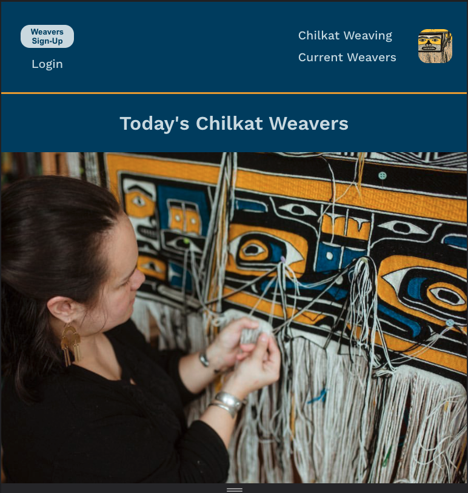
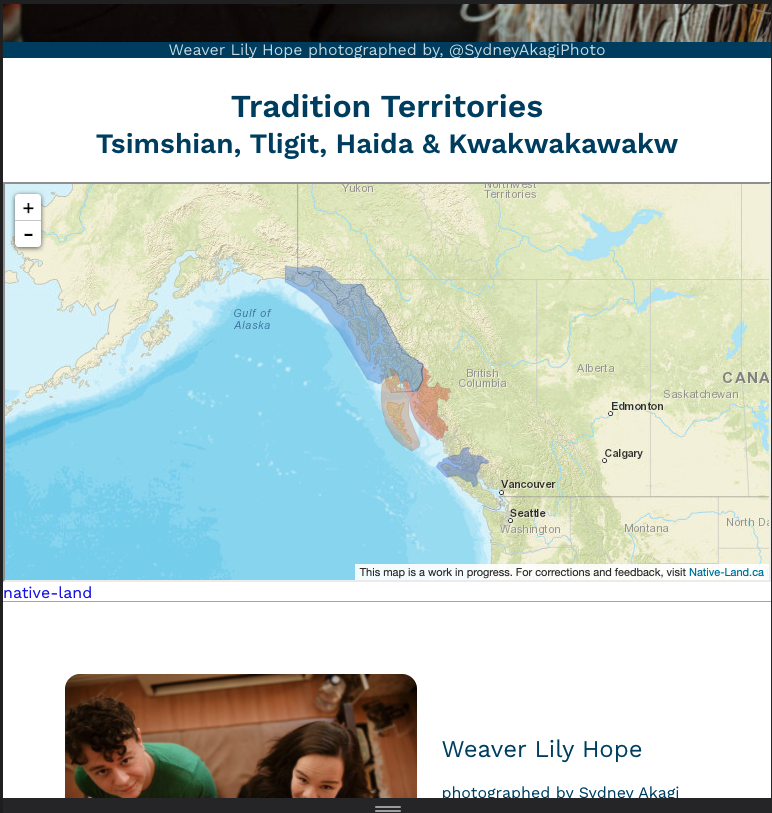
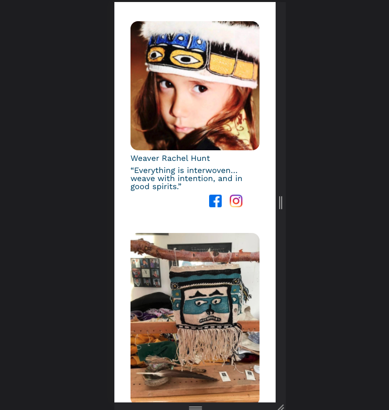
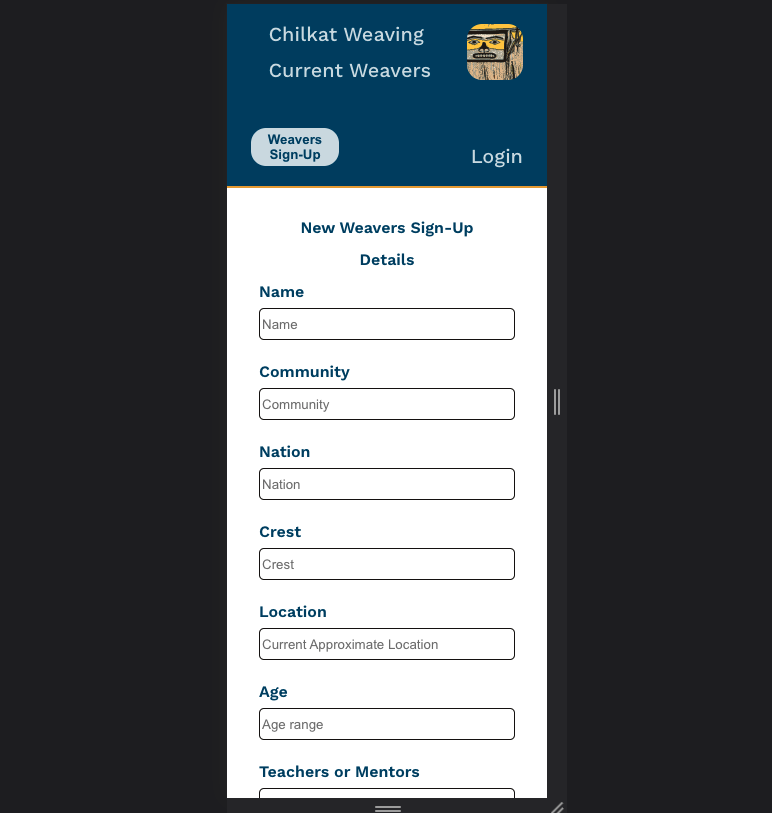
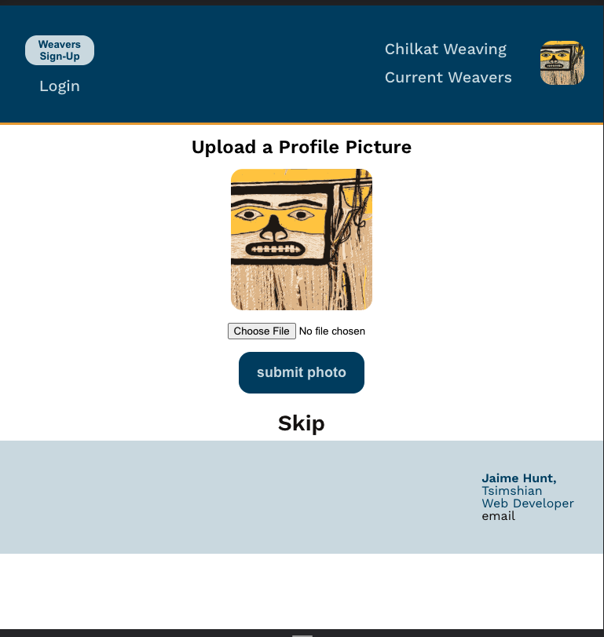
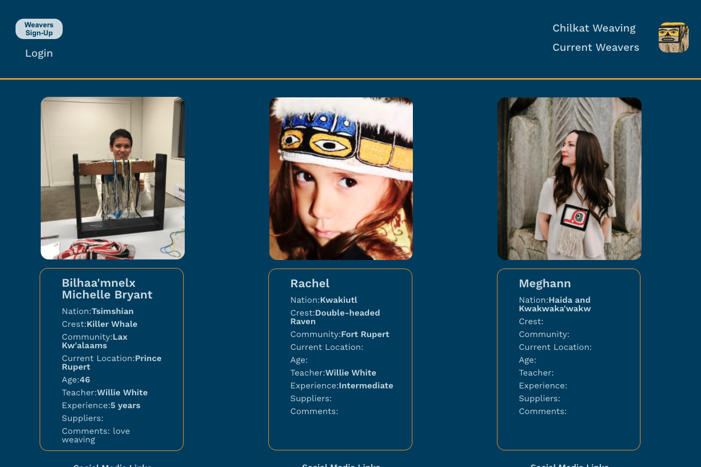

# Today's Chilkat Weavers

A web app to showcase current Chilkat Weavers.  A platform for weavers to sign up, share who they are and the weavings that they do.  This app is intended to work towards Cultural Revitalization by highlighting Indigenous voices, their culture and stories.  Chilkat weavers are still current and valued today. The content was thoughtfully designed after interviewing several weavers to find out their needs.

Full Stack Responsive Web App. 
Client side built with React and sass.  Fully responsive.
Server has a mySQL database with mutilple tables that join, with purpose to be scalable once launched.  Used multer so users can upload photos. Profiles can be edited.

## Acknowledgements

 - Thank you to all the Chilkat Weavers who contributed to this site.
 - https://native-land.ca/

## Installation

In terminal cd to ChilkatWeavers client:
$ npm start

In another terminal window cd to ChilkatWeavers server:
Using Mysql and knex,
$ npm run migrate

$ npm run seed

$ npm run dev

    
## Author

- Jaime Hunt

https://github.com/jaimedh

www.linkedin.com/in/jaime-hunt

## Screenshots

Landing page header and hero.

A map from native-land api.

Photos and quotes from current weavers.

A responsive site for mobile, tablet, and desktop. Signup form with some form validation as I wanted to leave it optional what is shared.

Image upload using multer.  Saves photo path in the database and photo to public folder on the server.

Cards of all the weavers who have signed up.

## Tech Stack

Client: React, Sass, axios.

Server: Node, MySQL, Express, Knex, multer.

